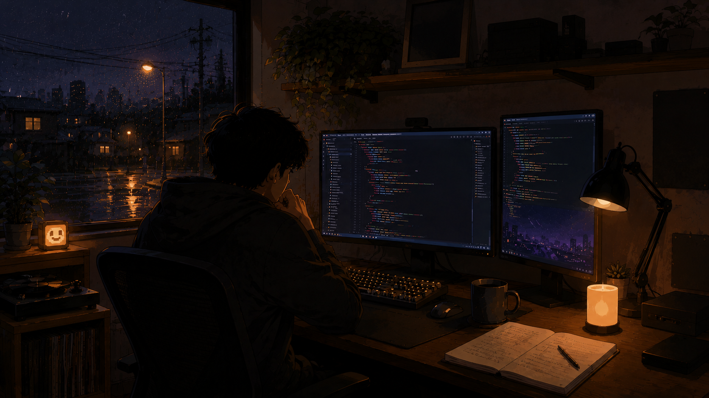

# smallhours

> The lamp is low. The room has gone quiet.
> Somewhere a branch opens, tests turn green, a pull request waits for morning.
> None of it needs you awake.

smallhours turns labeled issues into pull requests you review. You write the
issue and you press merge. Claude Code does the part in between, unattended,
inside your repository's Actions.

## The loop

1. You label a fully described issue `ready-for-agent`.
2. A sandboxed agent takes it and opens a draft PR from its own branch. The
   issue reads `agent-working`.
3. It stays on that PR, fixing red CI and revising when you request changes,
   until everything is green. Then `in-review`, and it's your turn.
4. Work that needs a person gets `ready-for-human`, and the agent starts the
   next issue.

Every issue carries exactly one state label, so the board is the status.
[CONTEXT.md](CONTEXT.md) defines them all.

## Start

Paste this into Claude Code, in the repo you want to onboard:

> Set up smallhours on this repo: fetch and follow
> https://raw.githubusercontent.com/bcanfield/smallhours/main/docs/GETTING-STARTED.md

Your share is a few clicks and one review.
[Getting started](docs/GETTING-STARTED.md) is the same walkthrough, written for
humans too.
